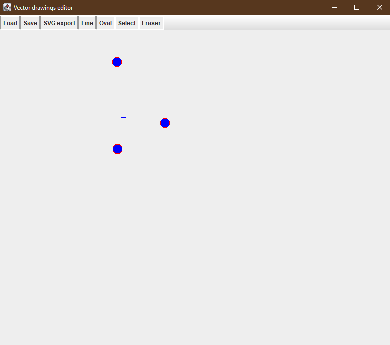
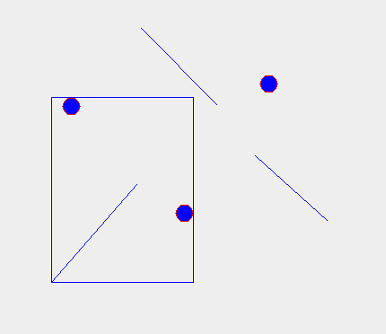

# Program for editing vector drawings
This is the program for editing vector drawings made in java

## How it works
In the toolbar there are 7 buttons. 
  
When you want to draw the line or the oval, first you need to press the 
corresponding button. 
They will firstly look like this. 
  
If you want to select a single shape you need to press the Select button and then the shape. 
When you select only one shape you will see its hot-points and with them you can change shapes size and orientation. 
You can move the selected shape by using arrow keys. 
You can also change its z-order, + key moves it closer to you and - key moves it further away. 
  
If you want to select more shapes you can do that by holding down CTRL key. 
When you have multiple shapes selected, you can merge them into one by pressing G on your keyboard and you can also unmerge them by pressing U on your keyboard. 
This is how merged shapes look like. 
  
If you want to delete some of the shapes, you need to press Eraser on the toolbar and then just press the mouse down and drag it. The mouse will leave the trail behind and if that trail goes through the shape, the shape will be deleted. 
Composites(merged shapes) count as only one shape, no matter how many individual shapes are in them. 
  
There is also a functionality of exporting the image in SVG format. 
You can also save and load the image in the custom .graph format. 
This format uses shape IDs and its hot-points to show them. 
For example: 
**@LINE 255 92 197 46** 
**@OVAL 144 123 134 133** 
**@LINE 112 319 207 210** 
**@COMP 2** 
**@OVAL 270 242 260 252** 
**@COMP 2** 
**@OVAL 349 108 339 118** 
**@LINE 324 188 404 260** 
**@COMP 2** 
Here we go line by line and read ID and hot-points. @LINE is line segment and @OVAL is oval. First two numbers are the first hot-point and the second two numbers are the second hot-point. @COMP is the composite and the number after the ID shows how many shapes before that line are inside the composite.  
## Run the program
If you want to test the program yourself you'll need to have java installed on your computer. 
If you do have it, you can just run **Vector-drawings.jar** which is located in root folder of this project.
